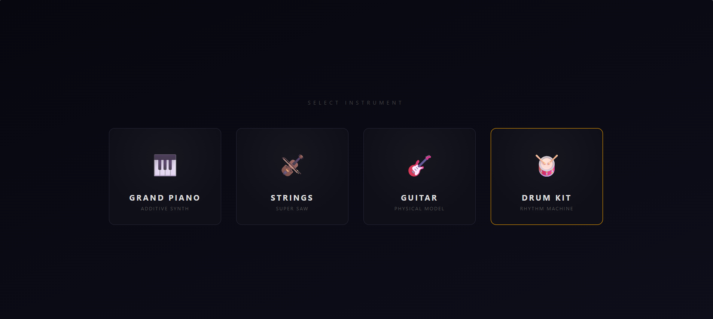
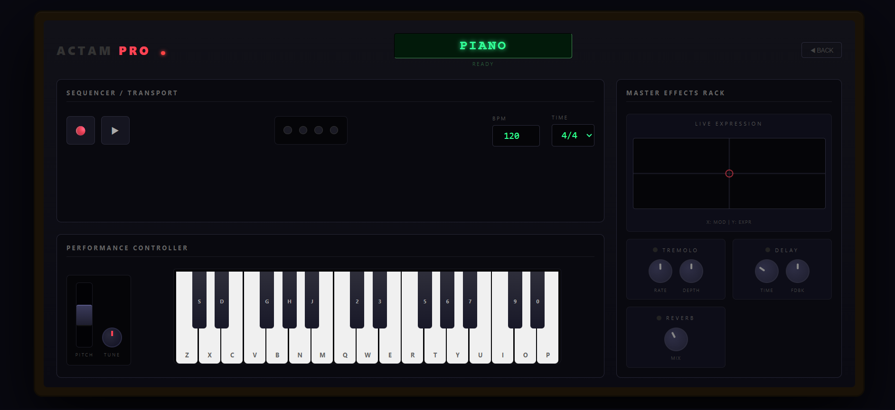
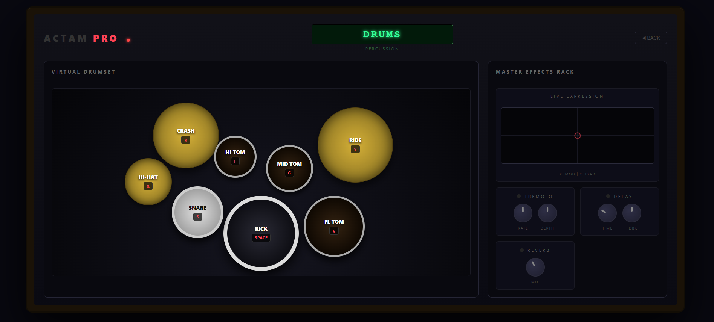

# 🎓 University Project: ACTAM PRO Audio Suite

### **Course: Advanced Coding Tools and Methodologies
**Developers:** Saeid Soleimani & Hanxiang Gao

**Institution:** Politecnico di Milano

**Project Objective:** To design and implement a low-latency, real-time Digital Signal Processing (DSP) engine capable of algorithmic sound synthesis via a web-based interface.

---

## 📌 Project Overview
**ACTAM PRO** is a collaborative full-stack audio application developed to explore the intersection of **Web Technologies** and **Digital Audio Synthesis**. The project demonstrates how high-level languages like Python can be optimized using vectorized mathematics (**NumPy**) to perform real-time audio generation without relying on pre-recorded samples[cite: 3, 5].

### **Core Functionalities:**
*   **Algorithmic Synthesis:** Real-time generation of waveforms for Piano, Strings, Guitar, and Drums[cite: 5].
*   **Low-Latency Communication:** Utilizing **WebSockets** for bi-directional, full-duplex data transfer between the UI and the Engine[cite: 2, 7].
*   **DSP Effects Rack:** Custom implementation of Tremolo, Delay, and Reverb using digital delay lines and comb filters[cite: 4].

---

## 📸 Project Interface

### **Instrument Selection Menu**
The entry point of the application where users can toggle between different synthesis models.

### **Main Performance Dashboard**
The primary workspace featuring the melodic keybed, transport controls, and the Master FX rack.

### **Virtual Percussion Layout**
A specialized UI designed for trigger-based rhythmic performance using a spatial drum kit map.

---

## 📽️ Functional Demonstration
*(A screen walkthrough demonstrating the real-time response and audio quality of the synthesis engines.)*

> **[https://youtu.be/Gx5ah5nWZkc]**

---

## ⚙️ Technical Implementation

### **1. Synthesis Models (`instruments.py`)**
Each instrument represents a distinct academic approach to digital sound generation:
*   **Additive Synthesis (Piano):** Synthesizing complex tones by summing multiple sine wave partials with unique exponential decay envelopes[cite: 5].
*   **Physical Modeling (Guitar):** Implementation of the **Karplus-Strong algorithm**, utilizing a filtered delay line to simulate the physics of a plucked string[cite: 5].
*   **Subtractive/Super-Saw (Strings):** Generating detuned sawtooth waves passed through a low-pass Butterworth filter[cite: 5].

### **2. The Audio Engine (`engine.py`)**
The "heart" of our system. It manages the `active_notes` dictionary and handles the high-priority `audio_callback`[cite: 3].
*   **Vectorization:** To meet real-time constraints, we use **NumPy** to process blocks of 512 frames, significantly reducing CPU overhead compared to scalar loops[cite: 3, 4].
*   **Polyphony Management:** A thread-safe locking mechanism ensures that multiple notes can be triggered and mixed simultaneously without audio dropouts[cite: 3].

### **3. Communication Architecture (`main.py` & `app.js`)**
*   **WebSockets:** We chose WebSockets over standard HTTP to achieve the sub-20ms latency required for musical "feel" and responsive performance[cite: 2, 7].
*   **State Synchronization:** Parameters like BPM, Reverb Mix, and Pitch Bend are synchronized across the network in real-time[cite: 2, 7].

---

## 🛠️ How to Run
1.  Ensure **Python 3.10+** is installed on your machine.
2.  Install the necessary scientific and audio libraries:  
    `pip install -r requirements.txt`
3.  Launch the application using the provided script:
    *   **Windows:** `run.bat`[cite: 8]
    *   **Linux/Mac:** `sh run.sh`[cite: 8]
4.  Open your browser to the local address provided in the terminal (default: `ws://localhost:8765`)[cite: 2].

---

## 📚 References & Libraries
*   **NumPy:** For high-speed matrix and array operations[cite: 3, 4].
*   **Sounddevice:** PortAudio interface for Python-based audio output[cite: 3].
*   **SciPy:** For IIR filter design and digital signal processing[cite: 5].
*   **WebSockets:** For the low-latency communication layer[cite: 2, 7].
