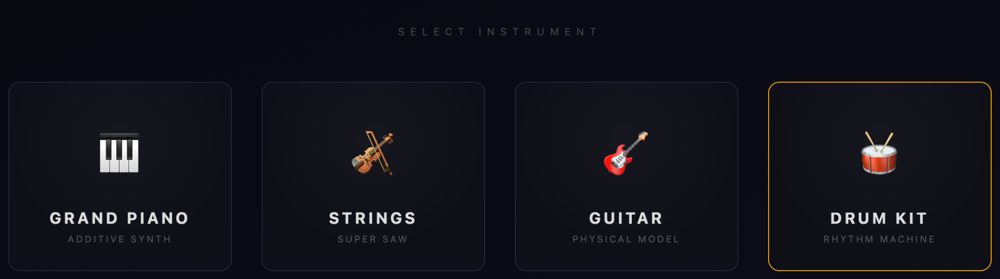
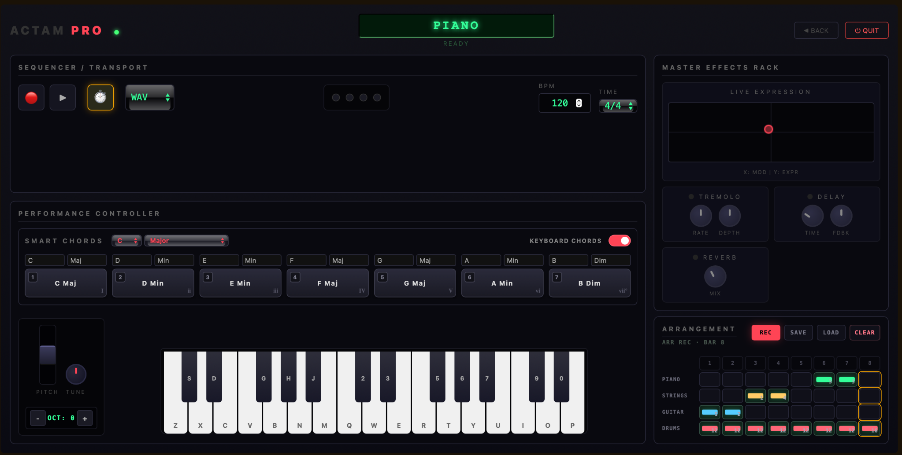
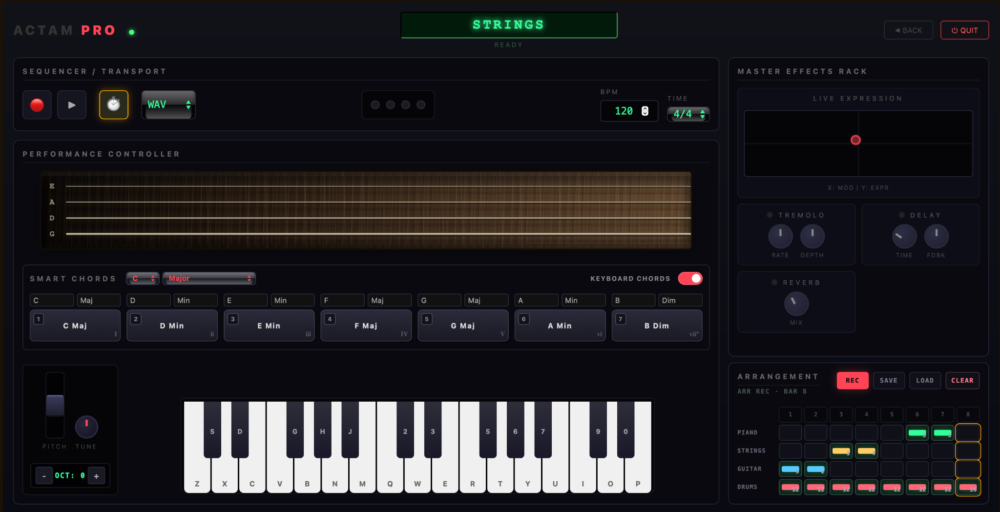
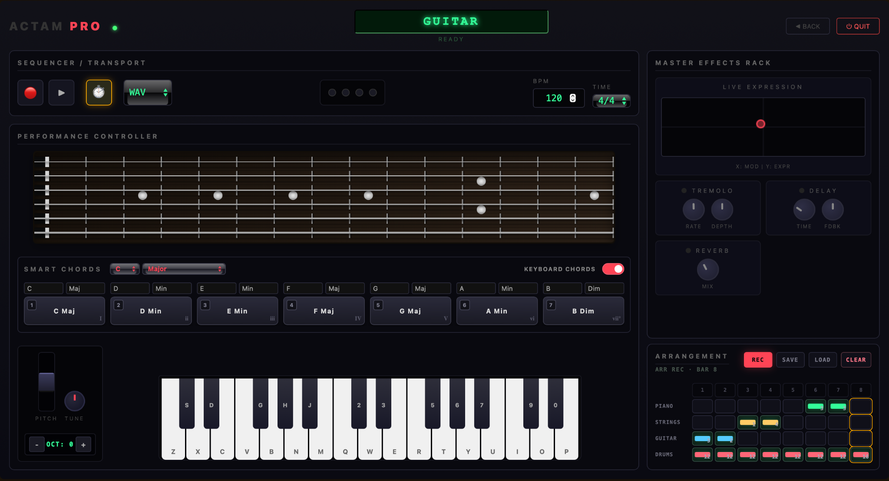
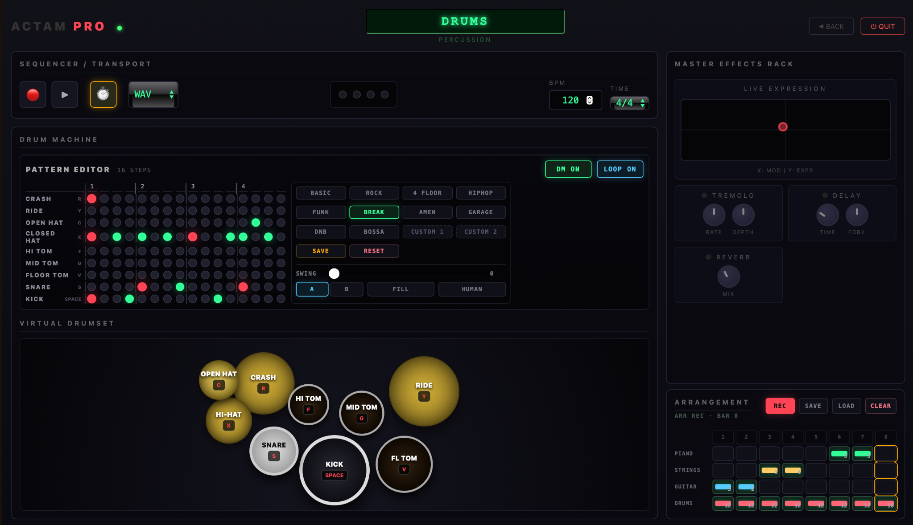

# ACTAM PRO | Web-Based Real-Time Audio Workstation

ACTAM PRO is a web-based real-time audio workstation built for live performance, synthesis, sequencing, effects processing, arrangement editing, and recording. The project combines a browser-based DAW-style interface with a Python audio engine.

The frontend provides the visual interface and performance controls, while the backend receives WebSocket messages, generates sound in real time, applies effects, and outputs audio through the system audio device.

---

## Project Structure

```text
ACTAM_PRO/
├── README.md
├── images/                         # README screenshots
│   ├── select-instrument.png
│   ├── piano-interface.png
│   ├── strings-interface.png
│   ├── guitar-interface.png
│   └── drum-machine.png
│
└── ACTAM_PRO/                       # Main application folder
    ├── index.html                   # Main browser UI
    ├── start.py                     # Opens the UI and starts the backend server
    ├── main.py                      # WebSocket server and message router
    ├── requirements.txt             # Python dependencies
    ├── run.bat                      # Windows launcher
    ├── run.sh                       # macOS / Linux launcher
    ├── recordings/                  # Saved WAV / MIDI recordings
    │
    ├── assets/
    │   ├── css/
    │   │   └── style.css            # Interface styling
    │   └── js/
    │       └── app.js               # Frontend interaction, sequencer, arrangement logic
    │
    └── server/
        ├── engine.py                # Real-time audio engine, mixing, recording
        ├── fx.py                    # Tremolo, delay, reverb and effect processing
        └── instruments.py           # Piano, strings, guitar and drum synthesis
```

### Basic Architecture

```text
Browser Frontend
HTML / CSS / JavaScript
        │
        │ WebSocket JSON messages
        │ note_on, note_off, chord, parameter, recording, transport
        ▼
Python Backend Audio Engine
NumPy / SciPy / sounddevice / mido
        │
        │ synthesis, mixing, effects, recording
        ▼
Audio Output + WAV / MIDI Export
```

---

## How to Run

### 1. Clone the repository

```bash
git clone https://github.com/SaeedSoleymani79/ACTAM_PRO.git
cd ACTAM_PRO/ACTAM_PRO
```

### 2. Install dependencies

```bash
pip install -r requirements.txt
```

The main Python dependencies are:

```text
numpy
scipy
sounddevice
websockets
mido
```

### 3. Start the application

```bash
python start.py
```

After startup, the browser interface opens automatically and connects to the Python audio server. The first launch may take a short moment because the backend precomputes the instrument sounds.

### Optional launch scripts

On Windows:

```bash
run.bat
```

On macOS / Linux:

```bash
chmod +x run.sh
./run.sh
```

---

## Main Features

## 1. Instrument Selection

The opening screen lets the user choose one of four instrument modes: piano, strings, guitar, and drums. Each instrument has its own performance interface, but they share the same transport, effects, and arrangement workflow.



---

## 2. Piano Interface

The piano mode provides a keyboard-based performance interface for melodic playing and chord triggering. It is suitable for testing the additive-style piano sound and for recording simple harmonic or melodic ideas into the arrangement section.



---

## 3. Strings Interface

The strings mode uses an ensemble / super-saw style sound. It keeps the same general performance layout while adapting the controller area for string-like playing and expressive sustained textures.



---

## 4. Guitar Interface

The guitar mode provides a guitar-oriented interface with fretboard-style visual control and chord support. It is designed for plucked-string performance and quick harmonic sketching.



---

## 5. Drum Machine

The drum mode combines virtual drum pads with a step-based rhythm machine. The pattern editor supports multiple drum lanes, preset patterns, swing, fill, humanization, loop mode, and custom pattern saving.



---

## 6. Shared Transport, Effects and Arrangement

Across all instruments, ACTAM PRO provides several shared production modules:

- **Sequencer / Transport**: play, stop, BPM control, time signature selection, WAV / MIDI recording controls.
- **Smart Chords**: choose a root note and scale type, then trigger mapped chords quickly.
- **Master Effects Rack**: live XY expression control, tremolo, delay and reverb.
- **Arrangement**: an 8-bar draft area for building short multi-instrument sections and saving musical ideas.
- **Recording**: backend recording support for exporting performances as WAV or MIDI files.

---

## Typical Workflow

1. Start the application with `python start.py`.
2. Select an instrument from the instrument selection screen.
3. Play using the keyboard, strings controller, guitar interface, or drum pads.
4. Adjust BPM, time signature, smart chords, and master effects.
5. Build rhythm patterns or record bars into the arrangement.
6. Export the performance as WAV or MIDI when needed.

---

## Project Goal

The goal of ACTAM PRO is to demonstrate a low-latency web-to-Python audio workstation that combines real-time performance, algorithmic synthesis, sequencing, effects processing, arrangement editing, and recording in a single interactive system.
