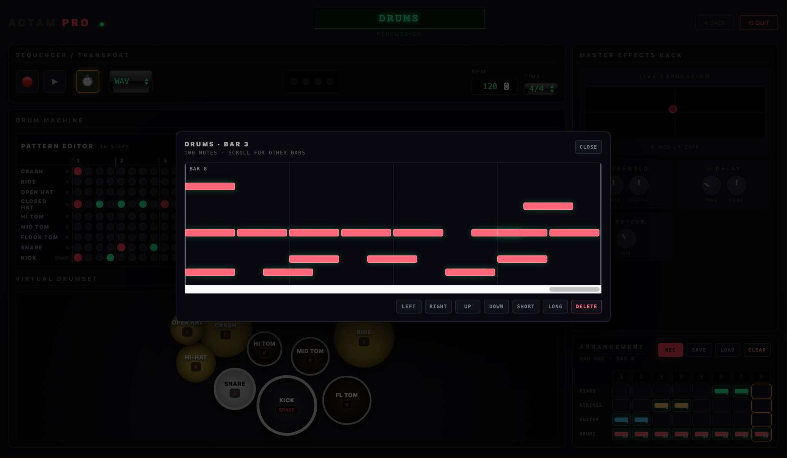

# ACTAM PRO | Web-Based Real-Time Audio Workstation

**ACTAM PRO** is a web-based real-time audio workstation for performance, sequencing, synthesis, effects processing, and recording. It was developed as an academic project for **Advanced Coding Tools and Methodologies** at **Politecnico di Milano** by **Saeid Soleimani** and **Hanxiang Gao**.

The system combines a browser-based musical interface with a Python audio engine. The frontend handles interaction, sequencing, chord control, instrument views, and arrangement editing, while the backend performs real-time DSP, synthesis, effects processing, and audio/MIDI recording.

---

## Basic Framework

```text
Browser Frontend
HTML / CSS / JavaScript
│
│  WebSocket JSON messages
│  note_on, note_off, chord, parameter, recording, transport
▼
Python Backend Audio Engine
NumPy / SciPy / sounddevice / mido
│
│  synthesis, mixing, effects, recording
▼
Audio Output + WAV / MIDI Export
```

### Frontend

The frontend is a DAW-style control surface built with **HTML, CSS, and JavaScript**. It is responsible for the visual interface and musical interaction logic, including:

- instrument selection;
- transport controls, tempo, and time signature;
- virtual piano keyboard, guitar fretboard, string controller, and drum pads;
- smart chord pads and keyboard chord triggering;
- drum step sequencer and pattern editor;
- arrangement grid for multi-instrument recording;
- master effects controls and XY expression pad.

### Backend

The backend is a **Python real-time DSP engine**. It receives performance and control messages from the browser, generates audio, applies effects, and streams the final output to the system audio device. It also supports session capture as audio and MIDI files.

### Communication

The frontend and backend communicate through **WebSockets**. The browser sends lightweight JSON control events, while the Python backend handles sound generation and real-time playback.

---

## Main Features

### 1. Multi-Instrument Performance

ACTAM PRO provides four main instrument modes:

- **Grand Piano** — additive synthesis style;
- **Strings** — super-saw / ensemble-style synthesis;
- **Guitar** — physical-model-inspired plucked string behavior;
- **Drum Kit** — rhythm machine with percussion pads and step sequencing.

Each instrument has a dedicated performance interface while sharing the same transport, effects, and arrangement system.


### 2. Sequencer and Transport

The global transport panel supports:

- play / stop / record workflow;
- BPM control;
- time signature selection;
- WAV recording mode;
- bar-based arrangement recording.

The transport controls are available across the instrument pages, allowing the user to keep a consistent workflow while switching between piano, strings, guitar, and drums.

### 3. Drum Machine

The drum interface includes a **16-step pattern editor** with multiple drum lanes such as kick, snare, hi-hat, toms, ride, crash, and open hat. It also supports groove-oriented controls such as pattern presets, swing, fill, humanization, loop mode, and drum-machine activation.


For more detailed rhythm editing, the drum part can also be viewed and edited in a piano-roll-style editor, where notes can be moved, shortened, extended, or deleted.



### 4. Smart Chords

The smart chord section lets the user choose a root note and scale type, then automatically maps harmonic chords to numbered pads. This allows quick chord performance from the keyboard and supports different instrument behaviors, especially guitar-oriented voicings.

### 5. Performance Controllers

Different instruments expose different real-time controllers:

- piano-style keyboard for melodic input;
- guitar fretboard visualization;
- string performance surface;
- virtual drumset pads;
- pitch and tuning controls.

| Piano Interface | Strings Interface |
|---|---|
|  |  |

| Guitar Interface | Drum Pads |
|---|---|
|  |  |

### 6. Master Effects Rack

The master effects rack applies effects to the final mix, including:

- XY live expression pad;
- tremolo;
- delay;
- reverb.

These controls allow real-time sound shaping during performance and recording.

### 7. Arrangement and Recording

The arrangement panel records musical ideas by bar and instrument track. It allows users to build short multi-instrument sections and export performances through backend recording.

---

## Installation and Running

Install dependencies:

```bash
pip install -r requirements.txt
```

Launch the application:

```bash
python start.py
```

After startup, the browser interface opens and connects to the Python audio engine. Once the backend finishes loading the instruments and the WebSocket connection is ready, the system can be played in real time.

---

## Typical Workflow

1. Start the application with `python start.py`.
2. Select an instrument from the instrument selection screen.
3. Use the keyboard, fretboard, chord pads, or drum pads to perform.
4. Adjust BPM, time signature, and master effects.
5. Build drum patterns or record arrangement bars.
6. Export the performance as WAV and/or MIDI when needed.

---

## Project Goal

The goal of ACTAM PRO is to demonstrate a low-latency web-to-Python audio workstation that combines real-time performance, algorithmic synthesis, step sequencing, effects processing, and recording in a single interactive system.
